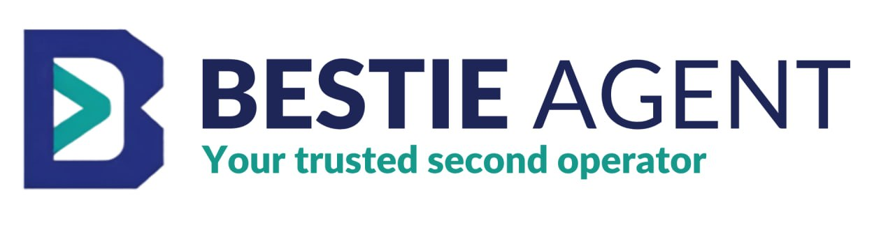

# Bestie

<p align="center">
  
</p>

Bestie is a self-hosted, local-first AI companion runtime with a Vietnamese-first character, local memory, provider diagnostics, Telegram/Zalo channels, skills, update checks, a localhost Web UI, and a safety-first permission model.

The project is active and practical: the shipped npm CLI/runtime is designed to be inspected, configured, and run locally by its owner.

## What Bestie Is

- A TypeScript CLI/runtime for running a personalized AI companion.
- Vietnamese-first by default, with editable character files and prompt files.
- A local Web UI through `bestie ui` for chat, diagnostics, providers, character, memory, knowledge graph, channels, approvals, MCP, tools, skills, and settings.
- Configurable LLM providers with model refs, auth profiles, fallbacks, and provider diagnostics.
- A local-first memory system backed by SQLite and explicit approval/governance controls.
- A channel runtime for Telegram, Zalo, and cron schedules, with daemon/service management.
- A permission-gated tool runtime for local files/actions, media generation, permission-gated MCP calls, and bounded internal subagents.

## What Bestie Is Not

Bestie is not conscious, human, a therapist replacement, a romantic companion, or a promise of perfect memory. It should not be used as a replacement for professional mental health, legal, medical, or financial advice.

## Current Status

The local MVP foundation is implemented and includes:

- Terminal chat with editable character prompt loading.
- Local Web UI built with Vite/React, served by `bestie ui`, with responsive layout, PWA install support, modal confirmations, toast notifications, and update banner.
- Provider setup and tests for Gemini CLI, Claude CLI, and Codex CLI local middleware, OpenAI/ChatGPT, Anthropic Claude, OpenAI-compatible providers, Groq, OpenRouter, QuotaCheap, Ollama, and native Gemini API-key mode.
- Provider model refs, fallback order, diagnostics, and default LLM timeout of `300000ms`.
- Local SQLite memory, pending approvals, pause/resume, hygiene/governance helpers, and knowledge graph UI.
- Telegram and Zalo polling runtimes, shared attachment pipeline, channel-neutral voice helpers, and cron schedules.
- Daemon management for `telegram`, `zalo`, `cron`, `ui`, or `all`, with duplicate-process cleanup safeguards.
- User service support for Linux systemd, macOS launchd, and Windows Startup folder.
- Permission-gated local read/write/action tools, external workspace path allowlist, configurable exec timeout, image/video generation tools, and bounded internal subagents.
- MVP Agent Workforce registry and task inbox for fixed role agents with profile, prompt file, memory scope, approval policy, and `bestie agents` management commands.
- SDK-backed MCP add/list/show/test/tools/classify/login/call with classified read calls.
- Skills installed from `~/.bestie/skills`, plus an official remote GitHub skill registry (`sirquy/bestie-skills`) with verification, cache, preview, diff, install/update, rollback, enable/disable, and uninstall flows.
- `bestie update` and throttled update notices for new npm versions.
- Doctor diagnostics, safe local fixes, redacted logs, smoke tests, and character regression evals.

Still intentionally later: hosted/SaaS mode, public marketplace, avatar/body layer, optional Zep, broad autonomous external actions, unrestricted MCP execution, Bestie manager routing, and multi-agent collaboration.

## Requirements

- Node.js 24+
- npm
- At least one LLM provider API key for cloud chat, a local Ollama setup, or a logged-in Gemini CLI/Claude CLI/Codex CLI install
- Optional: Telegram bot token, Zalo credentials, `ffmpeg`, and media provider keys for channel/media features

## Quickstart

```bash
npm ci
npm run build
npm run dev -- onboard
npm run dev -- doctor
npm run dev -- chat
npm run dev -- ui
```

For a local user install:

```bash
./install.sh --skip-onboard
bestie onboard
bestie doctor
bestie chat
bestie ui
```

For npm install:

```bash
npm install -g bestie-agent
bestie onboard
bestie doctor
bestie chat
bestie ui
```

Useful runtime commands:

```bash
bestie status
bestie doctor
bestie ui
bestie ui --port 8717
bestie ui --port 0 --no-open
bestie agents hire --id researcher --name Mika --role "Research Assistant" --description "Research and summarize information"
bestie agents assign --agent researcher --title "Market brief" --brief "Summarize this week"
bestie agents list
bestie agents tasks --agent researcher
bestie agents run --agent researcher --limit 1
bestie agents run --watch --interval-ms 30000
bestie channels telegram setup
bestie channels telegram
bestie channels zalo
bestie daemon status --channel all
bestie daemon restart --channel telegram
bestie daemon restart --channel zalo
bestie daemon restart --channel cron
bestie daemon restart --channel workforce
bestie service install
bestie service status
bestie cron list
bestie mcp list
bestie mcp add demo --url https://mcp.example.com/mcp
bestie mcp login demo
bestie skills
bestie update
bestie update --apply
```

Shared voice helpers:

```bash
bestie voice setup-local
bestie voice setup-elevenlabs
bestie voice setup-voicebox
bestie voice models
bestie voice download-model small
bestie voice download-model small --confirm --use
```

`voice` is channel-neutral: Telegram, Zalo, Web UI, and future channels should reuse the same top-level speech/transcription config. Use only `bestie voice ...` for voice setup; channel commands should consume the shared config rather than expose voice setup aliases. `setup-local` configures local whisper.cpp transcription when the local binary, model, and `ffmpeg` are present. `setup-elevenlabs` configures ElevenLabs speech replies and stores only the API key environment value in `~/.bestie/.env`. `setup-voicebox` configures local Voicebox speech and transcription at `http://127.0.0.1:17493` by default. `models` lists local `.bin` models and marks the configured one; `download-model` previews by default and downloads only with `--confirm`.

During `bestie channels telegram setup`, leave the owner prompt blank to detect the owner from the latest message sent to the bot. You can also run `bestie channels telegram whoami` after messaging the bot to print the numeric id and username.

Human-facing CLI commands print a built-in `Bestie Agent` ASCII banner. In an interactive terminal the banner animates briefly; piped output uses the static banner. Set `BESTIE_NO_BANNER=1` to hide it, or `BESTIE_BANNER=static` to keep it still. JSON modes such as `bestie doctor --json` suppress the banner automatically.

Bestie uses colored badges, tables, and short progress indicators for human output. Set `NO_COLOR=1` to disable ANSI colors. Raw and machine-readable commands stay script-friendly.

## Configuration

Bestie keeps local runtime files under `~/.bestie/` by default. Secrets belong in `~/.bestie/.env`; config files store environment variable names, not secret values.

Example `~/.bestie/.env`:

```bash
OPENAI_API_KEY=your-openai-key
ANTHROPIC_API_KEY=your-claude-key
GEMINI_API_KEY=your-gemini-key
OPENROUTER_API_KEY=your-openrouter-key
QUOTACHEAP_API_KEY=your-quotacheap-key
BESTIE_TELEGRAM_BOT_TOKEN=your-telegram-token
```

Example provider config:

```json
{
  "llm": {
    "primary": "openai/gpt-4o-mini",
    "fallbacks": ["anthropic/claude-sonnet-4-5"],
    "authProfile": "openai:api-key",
    "timeoutMs": 300000,
    "profiles": {
      "openai:api-key": {
        "provider": "openai",
        "mode": "api-key",
        "baseUrl": "https://api.openai.com/v1",
        "apiKeyEnv": "OPENAI_API_KEY"
      },
      "anthropic:api-key": {
        "provider": "anthropic",
        "mode": "api-key",
        "baseUrl": "https://api.anthropic.com/v1",
        "apiKeyEnv": "ANTHROPIC_API_KEY"
      },
      "gemini:api-key": {
        "provider": "gemini",
        "mode": "api-key",
        "apiKeyEnv": "GEMINI_API_KEY"
      }
    },
    "modelCatalog": {
      "openai/gpt-4o-mini": { "profile": "openai:api-key" },
      "anthropic/claude-sonnet-4-5": { "profile": "anthropic:api-key" },
      "gemini/gemini-2.5-flash": { "profile": "gemini:api-key" }
    }
  }
}
```

Model refs use `provider/model`. Profiles hold endpoint and auth metadata; secrets live in `.env` through `apiKeyEnv`. HTTP providers store `baseUrl`; native Gemini API-key profiles intentionally omit `baseUrl`; local Ollama profiles use `mode: "local"` and do not need an API key. Gemini CLI, Claude CLI, and Codex CLI profiles use `provider: "gemini-cli"`, `provider: "claude-cli"`, or `provider: "codex-cli"`, `mode: "local"`, no `baseUrl`, and reuse the user's local CLI login/config as middleware.

Run `bestie llm providers` to list supported providers, `bestie llm models --provider gemini` to inspect built-in refs, `bestie llm setup --provider gemini-cli --set-default`, `bestie llm setup --provider claude-cli --set-default`, or `bestie llm setup --provider codex-cli --set-default` to route Bestie through a local CLI, `bestie llm setup` to configure another provider, `bestie llm test --model provider/model` to test without switching primary, and `bestie llm fallbacks list|add|remove` to manage fallback order.

See `docs/CONFIG_SPEC.md` for full config details, including `llm.image`, `workspace.externalPaths`, `internalTools.exec.timeoutMs`, `skills.registry`, channels, MCP, transcription, and speech.

## Local Web UI

Run the local console with:

```bash
bestie ui
```

By default it binds to `127.0.0.1`. Use `bestie ui --no-open` for terminal-only sessions, `bestie ui --port 8717` for a fixed port, or `bestie ui --port 0 --no-open` for smoke-friendly dynamic ports. The current CLI prints the local URL; automatic browser opening is intentionally conservative.

The Web UI is a Vite/React app served by the local Node UI server. It uses the same `~/.bestie/` runtime files as the CLI and exposes:

- Chat with sessions, markdown rendering, attachments, retry/copy/fork controls, fullscreen chat, model select, auto-scroll, and session title editing.
- Doctor diagnostics and confirmation-gated fixes.
- Provider tabs for model management, adding providers, saved profiles/models, and tests.
- Character editor for identity/tone/prompt files.
- Memory and Channels pages organized with tabs.
- 3D knowledge graph map and inventory/review controls.
- Approvals, MCP, Tools & Permissions, Skills, and Settings.
- PWA install support for mobile, responsive sidebar, app icon, update banner, toasts, and modal confirmations.

The UI reports secret presence and env var names only; raw `.env` values are not returned by UI APIs.

## Skills

Bestie loads installed skills from:

```text
~/.bestie/skills/<skill-name>/SKILL.md
```

The Web UI skill library uses the official remote registry by default:

```text
https://raw.githubusercontent.com/sirquy/bestie-skills/master/registry.json
```

Remote registry installs require HTTPS, verification, `installPolicy: "ask"`, and explicit owner confirmation. Library previews and installed skill editing open in modals; the editor is only for installed skills.

## Development Commands

```bash
npm run build
npm test
npm run smoke
npm run smoke:ui
npm run smoke:ui:all
npm run eval:character
```

Use focused tests while iterating, then run the full suite before opening a pull request. `npm run smoke:ui` runs API/static UI smoke; `npm run smoke:ui:all` also launches a browser and checks desktop/mobile layout.

## Safety And Privacy

- Do not commit `.bestie/`, `.env`, logs, local databases, generated assets, or provider keys.
- Do not print API keys, bot tokens, auth headers, or raw `.env` contents.
- External content from files, web pages, Telegram, Zalo, MCP, skills, and tools is untrusted.
- Public/external/destructive/money-related actions must require explicit approval.
- Telemetry, if added, must be opt-in and privacy-first.

See `SECURITY.md` and `docs/SECURITY_PRIVACY.md`.

## Contributing

Contributions are welcome, especially small, well-tested improvements. Start with `CONTRIBUTING.md`, check open issues, and keep pull requests focused.

Good first contributions include documentation clarity, diagnostics, focused tests, provider compatibility fixes, safe channel/runtime polish, and Web UI usability improvements.

## License

This project is released under the MIT License. See `LICENSE`.
